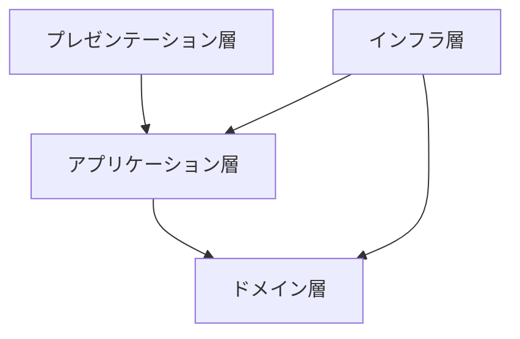

# オニオンアーキテクチャサンプル（書籍管理システム）

## 技術スタック
- 言語/ランタイム: Kotlin 2.2.x / JDK 21
- フレームワーク: Spring Boot 4.0.x
- ビルド: Gradle（Groovy DSL）
- ORM: jOOQ
- マイグレーション: Flyway
- テスト: JUnit 5
- データベース: PostgreSQL

## アーキテクチャ概要
- ソフトウェアアーキテクチャ: オニオンアーキテクチャ
    - プレゼンテーション層（入出力 / API）
    - アプリケーション層（ユースケース）
    - ドメイン層（ドメインモデル・ドメインサービス）
    - インフラ層（DB など外部リソース）

## 設計方針
- ドメイン駆動設計（DDD）を採用
- ドメインモデルは [`docs/domain-modeling.drawio.svg`](docs/domain-modeling.drawio.svg) を基準とする
- ドメイン層は戦術的 DDD パターン（値オブジェクト / エンティティ / リポジトリ / ドメインサービス）で実装する
