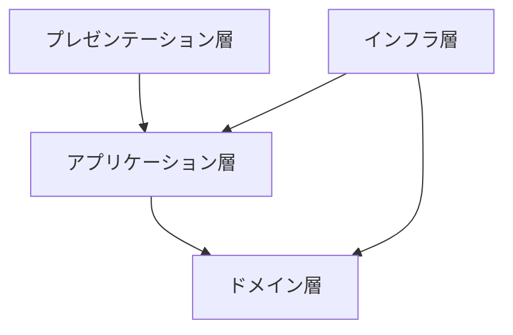

# アーキテクチャ概要

## システムアーキテクチャ
- 書籍管理という限定的な要件のため、モノリシックアーキテクチャを採用する
- ローカル環境 
  - アプリケーションと PostgreSQL は 個別コンテナとして実行する 
  - Docker Compose により複数コンテナ（アプリ・DB）の起動・依存関係を管理する

## ソフトウェアアーキテクチャ
- DDD/オニオンアーキテクチャを採用
    - プレゼンテーション層（入出力 / API）
    - アプリケーション層（ユースケース）
    - ドメイン層（ドメインモデル・ドメインサービス）
    - インフラ層（DB など外部リソース）

### レイヤーごとの責務
- プレゼンテーション: リクエスト/レスポンス変換とバリデーション結果の返却に限定する
- アプリケーション: ユースケース単位のサービス、トランザクション境界、ワークフロー調整を担う
- ドメイン: ビジネスロジックと不変条件を集約する
- インフラ: RDB や外部システム連携を担当し、ドメインにインフラ詳細を漏らさない

### 設計の進め方
- ドメインモデルは [`docs/domain-modeling.drawio.svg`](docs/domain-modeling.drawio.svg) を基準とする
- ドメイン層は戦術的 DDD パターン（値オブジェクト / エンティティ / リポジトリ / ドメインサービス）で実装する

## API 設計の前提
- REST 原則に従う（リソース指向、HTTP メソッドの意味付け）
- HATEOAS は必須ではない
- URI パターン・命名・レスポンス形式は既存 API と整合させる
